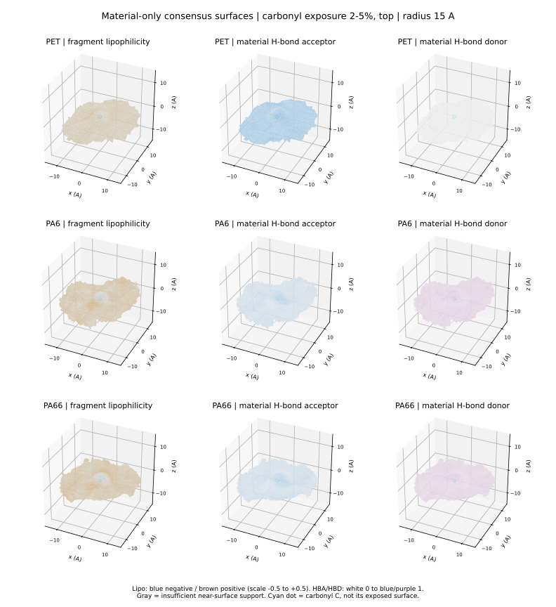
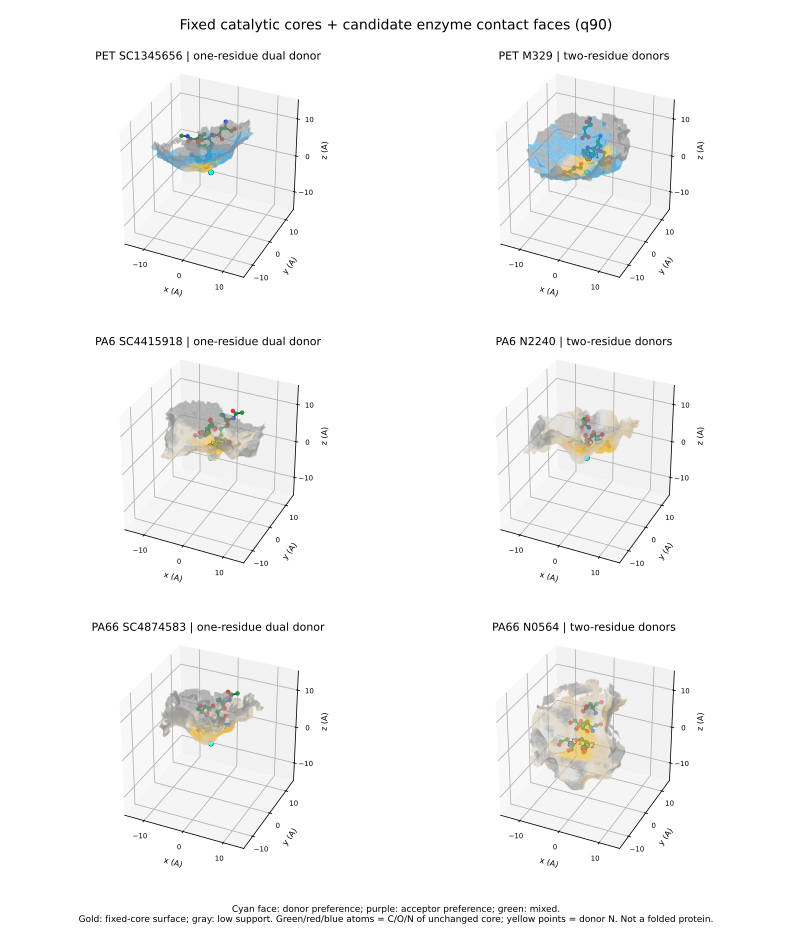

# PET / PA6 / PA66 材料化学表面与固定核心接触面：v3

状态：计算与网格审计完成；化学指标为经验代理，酶面为局部接触面假设；未验证完整蛋白、折叠、结合能或催化活性。

## 本轮实际补齐

- 材料本身：1436个位点，按原暴露分层、上下侧分开，排除68个数值/连通性不确定与2个法向不明确位点后，1366个位点构成29组材料共识面。没有用催化核心筛选材料总体。
- 固定核心：18个材料/核心组合，每个计算q50、q90、q100，共54个候选酶接触面；另有18个适配材料中位面。所有均为羰基碳15 A范围内、最近的连通开放网格，无方盒或球壳封口。
- 原始核心与供体坐标、适配位点名单均逐项核对，未增加供体采样或改变排名分母。

## 查看

材料文件是2-5%暴露组的上表面代表，其他暴露组在远程完整输出中。下载下列 .py 到任意位置，在PyMOL用 File > Run 打开。无需另外下载原PDB或安装RDKit。当前仅完成语法、载荷和模拟API执行检查，实际PyMOL GUI为NOT_EVALUATED。一次打开一个文件，避免同名对象覆盖。

- PET: [材料表面](PET_material_view.py)；[SC1345656](PET_SC1345656_view.py)；[M329](PET_M329_view.py)
- PA6: [材料表面](PA6_material_view.py)；[SC4415918](PA6_SC4415918_view.py)；[N2240](PA6_N2240_view.py)
- PA66: [材料表面](PA66_material_view.py)；[SC4874583](PA66_SC4874583_view.py)；[N0564](PA66_N0564_view.py)

材料对象可分别启用 *_lipo、*_hba、*_hbd、*_support。核心文件默认显示enzyme_contact_q90，可禁用后启用enzyme_contact_q50/q100；matched_material_median是材料面，support_q90是接触支持比例。

## 全部18套结果

下表“无穿入”仅指网格顶点按面积加权的材料穿入深度>0.4 A为零，不是所有原子无碰撞、可折叠或有活性。q90不是90%位点整面适配。

|材料|核心|原核心适配数|q90平均穿入面积%|q90无穿入位点数|q100平均穿入面积%|q100无穿入位点数|q100化学支持面积%|
|---|---|---:|---:|---:|---:|---:|---:|
|PET|SC1345656|44/578|3.829|11|0.029|39|11.2|
|PET|SC1989827|40/578|3.668|10|0.022|37|10.9|
|PET|SC3000704|41/578|4.472|12|0.052|31|15.6|
|PET|M450|31/578|4.667|3|0.210|11|18.3|
|PET|M329|29/578|3.988|4|0.127|11|19.2|
|PET|M318|26/578|4.844|6|0.327|10|29.9|
|PA6|SC4399876|17/413|4.613|2|0.172|10|24.2|
|PA6|SC4415918|16/413|4.245|2|0.101|10|20.1|
|PA6|SC4927359|16/413|3.900|1|0.149|8|17.7|
|PA6|N2240|9/413|5.133|1|0.292|5|55.7|
|PA6|N1626|6/413|4.568|1|0.291|2|56.2|
|PA6|N2403|6/413|5.388|1|0.026|5|47.9|
|PA66|SC4874583|21/445|4.416|6|0.179|14|20.1|
|PA66|SC4927359|17/445|4.317|5|0.147|12|18.8|
|PA66|SC4309501|18/445|3.875|6|0.109|11|26.7|
|PA66|N0564|12/445|3.834|1|0.111|7|30.1|
|PA66|N2240|12/445|3.591|3|0.113|9|37.2|
|PA66|N2303|12/445|3.989|3|0.056|7|34.0|

## 科学解释与边界

1. 亲疏水不是元素色：由完整SDF化学图和ITP逐键核对后计算Wildman-Crippen原子片段logP贡献，显式H归到相邻重原子；8近邻、1.5 A平滑。它不是水合自由能、表面真实logP或静电势。正负符号不能直接定义严格亲水/疏水面积。
2. 平均会稀释斑块：按羰基和法向对齐后，远端芳环/亚甲基/极性基团方向可能不一致。均值较均匀不证明每个真实位点均匀；NPZ保存标准差及接近材料面的位点支持比例。HBA/HBD应独立查看，不能被片段logP代替。
3. 酶化学面只表示接触偏好：面对材料HBA可考虑酶HBD，反之亦然；不意味着必须形成该氢键，不代表电荷反号，更没有评估去溶剂化。
4. 几何面由材料局部场分位数、0.5 A退让距离与固定核心vdW体积并集合成。它是局部接触边界，不是完整酶外形；只验证核心原子中心在局部体积内，未验证骨架连通、核心所有原子表面包埋、反应通道及动态进攻。
5. q50偏贴合但碰撞较多；q100更保守却可能失去共同接触支持。不能直接将覆盖最多的核心宣布为最佳完整酶。应在这些固定条件内，以整面碰撞与接触保留共同评价。
6. 单一模拟快照、继承原暴露定义与不确定标记。0.5 A全局网格、1 A局部网格；孤立碳测试的平移网格半径最大误差约0.24 A，不能声称亚网格精度。
7. 当前输出覆盖各暴露水平的材料独立共识面，以及各固定核心的全部匹配位点共识面；尚未把每套核心进一步按暴露层细分重拟合，也没有跨材料唯一通用酶面结论。

## 版本更正

- v1存在额外半网格偏移，保留为诊断产物。
- v2去掉偏移，但水侧距离截为-1.4 A，导致化学支持错误虚高至100%；v2化学支持统计作废。
- v3保留零等值面附近定义，增加水侧距离延拓并扩大XY周期边距至20 A。合成平面测试确认远端水距递减、材料侧场不变。
- 之前几何界面报告的“完成”不包含材料亲疏水图或酶接触面，本报告才补充这两类明确输出。历史结果不删除，不混作已验证酶结构。

## 可复现性与存储

远程完整输出：/data/bht2/polymer_material_reference_20260827/simulation_slabs/interface_surface_robustness_20260908_v1/chemical_contact_surface_full_v3

重跑：在项目根目录用既有CPU环境运行 chemical_contact_surface_v3.py --output NEW_VERSION_NAME；随后运行 chemical_contact_publish_v3.py（其输入固定为full_v3，输出必须不存在）。
脚本、运行日志和RUNBOOK保留在远程项目。GitHub本轮发布代表性查看脚本、审计、图和报告；全部NPZ/PLY未上传，不是全量备份。

输入与计算source SHA256：c422f2364a4587ccf7c75b886337319e568854c8902ced5f9c283d3d292d1ab9

## 方法来源

- [RDKit Wildman-Crippen](https://www.rdkit.org/docs/source/rdkit.Chem.Crippen.html)
- [Euclidean distance transform分子表面方法](https://pmc.ncbi.nlm.nih.gov/articles/PMC2779860/)，仅作为方法依据，不替代本实现离散误差审计。
- [scikit-image marching cubes](https://scikit-image.org/docs/stable/api/skimage.measure.html#skimage.measure.marching_cubes)
