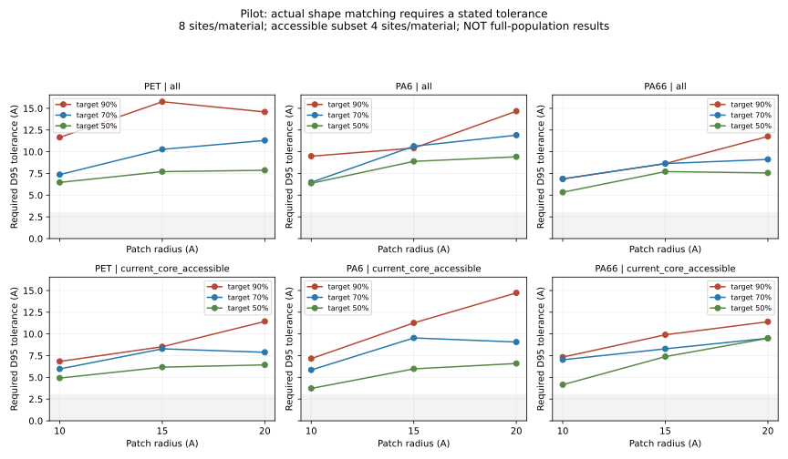

# 三尺度材料表面：实际形状匹配试算

**状态：试算完成，非全量结果；未证明单一共性面能在小误差下覆盖50/70/90%的总体位点。**
PET、PA6、PA66各确定性抽取8个位点，其中4个属于当前核心面板可接近集合。各材料2集合×3尺度×3档，共54项。全体集合的8个位点已包含那4个可接近位点，不是每种材料12个。

## 70%档实际需要的形状容差

|材料|试算集合|半径10 A|半径15 A|半径20 A|
|---|---|---:|---:|---:|
|PET|全部抽样位点 N=8|7.37 A|10.28 A|11.30 A|
|PET|可接近抽样位点 N=4|5.97 A|8.28 A|7.89 A|
|PA6|全部抽样位点 N=8|6.47 A|10.64 A|11.91 A|
|PA6|可接近抽样位点 N=4|5.85 A|9.54 A|9.07 A|
|PA66|全部抽样位点 N=8|6.87 A|8.64 A|9.12 A|
|PA66|可接近抽样位点 N=4|7.03 A|8.29 A|9.51 A|

这里70%要求ceil(8×0.7)=6或ceil(4×0.7)=3；相同R20选中位点用于R10/R15，较小尺度上可能额外匹配其他位点。这个容差不是先验合格阈值，更不能因为把容差放大后计数达到目标就称为良好匹配。

## 图与化学图层

- [PET all 三尺度亲脂性/HBA/HBD](PET_all_pilot_surfaces.svg)
- [PET current_core_accessible 三尺度亲脂性/HBA/HBD](PET_current_core_accessible_pilot_surfaces.svg)
- [PA6 all 三尺度亲脂性/HBA/HBD](PA6_all_pilot_surfaces.svg)
- [PA6 current_core_accessible 三尺度亲脂性/HBA/HBD](PA6_current_core_accessible_pilot_surfaces.svg)
- [PA66 all 三尺度亲脂性/HBA/HBD](PA66_all_pilot_surfaces.svg)
- [PA66 current_core_accessible 三尺度亲脂性/HBA/HBD](PA66_current_core_accessible_pilot_surfaces.svg)

所有图均为70%档候选的试算展示。亲脂性、HBA、HBD独立显示；颜色为后注释，没有参与形状优化，也不是水合自由能或表面电势。

## 方法与局限

- 原始完整材料快照、XY周期、外部水连通近似SES，保持0.5 A全局网格；局部网格1 A，扩展至±22 A。未改变MD或供体采样。
- 原版只有中心位点的块体筛选；本试算增加网格点内侧密度支撑>=70%的筛选（R10圆盘81点、向内5 A、沿固定局部法向）。这是剔除松散表面部分的几何近似，不是链拓扑判定；过滤前后面积保存在远程mesh_scope_audit.json。
- 同一材料局部法向+C=O投影坐标，三尺度使用同一候选场和选中位点，不做逐位点自由旋转来美化匹配。
- D95为两个方向各自按表面积加权的95%最近采样面距离之较大者；另存最大采样偏差。不是全部表面最大距离，也不是原子碰撞。
- 候选仅有样本真实面和中位数面，有限库内按R20所需容差选择；不是全局最优，也不足以否定其他拟合/分群方法。没有人为削平，也没有强制制造凹凸。
- 1/2/3 A下的实际计数均保存在all_pilot_results.json；缺失/无法评估必须保留，不能暗中改变分母。
- 全量位点未计算：PET578/当前面板可接近131；PA6 413/47；PA66 445/58。PA6全量2个位点法向不确定需保留NOT_EVALUATED。本试算不代表这些总体分布。
- 历史473套PET双残基、3021套尼龙双残基、5151932套单残基耦合候选与当前101套面板不同；本轮没有完成历史全库的供体条件界面拟合。

## 诊断与下一步

PET不做网格点支撑过滤时，R10/R15/R20真实面两两D95中位数约4.64/7.86/10.22 A；改用统一slab法向的对照约4.50/6.51/7.97 A。框架选择影响部分差异，但大偏差不只由新增过滤导致。该对照没有替换主方法。
建议先在全量位点上建立形状类别，分别报告每类共识、类内误差与总体占比，再研究多个界面共同覆盖；不得将多个类别覆盖之和标为同一酶面覆盖率。单面全量拟合未启动，不能宣称科学目标已完成。

## 文件与复现

服务器项目根目录：/data/bht2/polymer_material_reference_20260827/simulation_slabs/interface_surface_robustness_20260908_v1
脚本：multiscale_material_match_v1.py、test_multiscale_material_match_v1.py、audit_multiscale_material_pilot_v1.py、render_multiscale_material_pilot_v1.py。运行日志在RUN_LOG.jsonl，说明追加于RUNBOOK.md。
GitHub发布本报告、汇总JSON与图，不宣称全量NPZ/PLY/PyMOL文件均已备份。本地未下载，新PyMOL GUI未验证。
