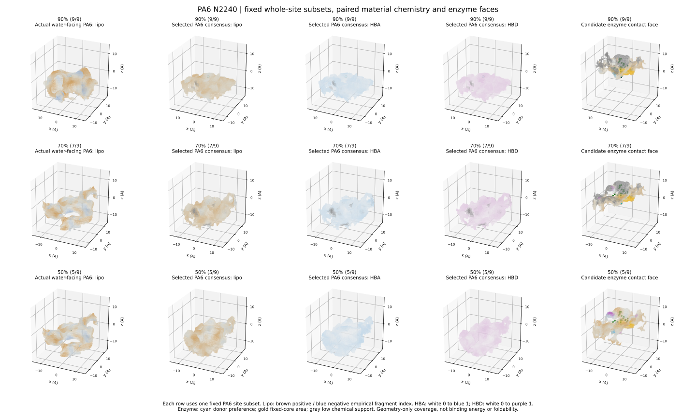
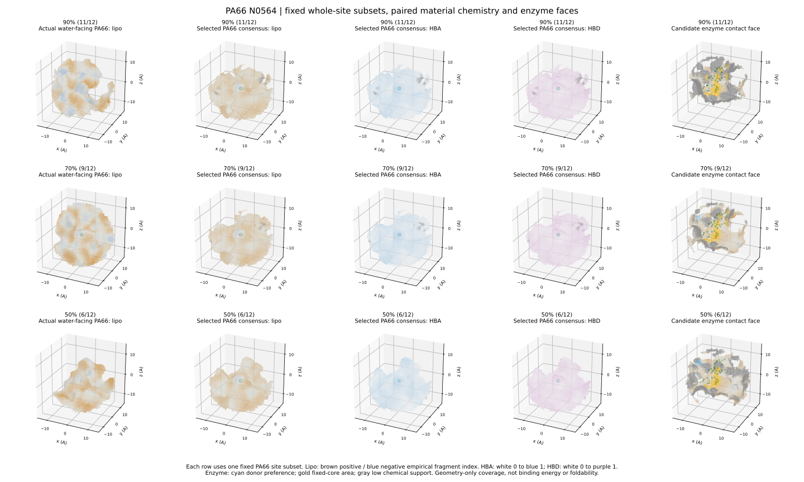
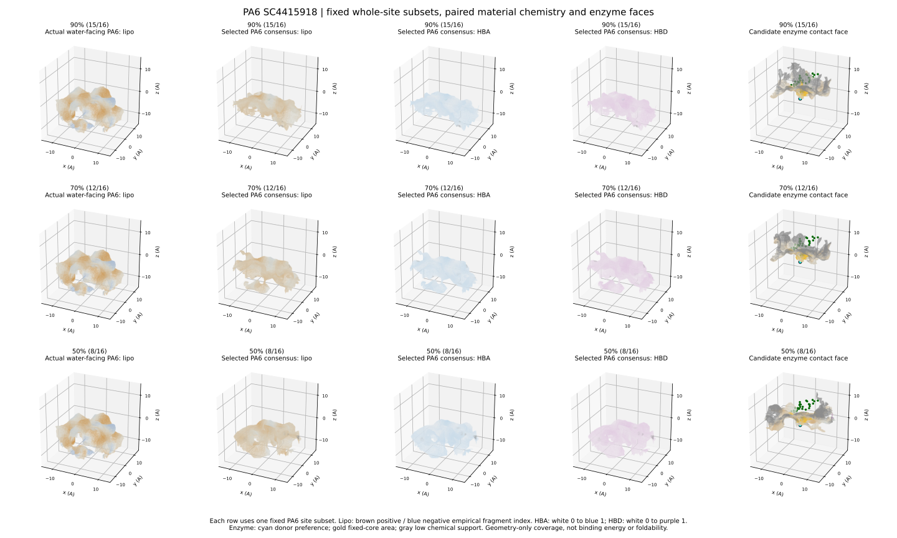
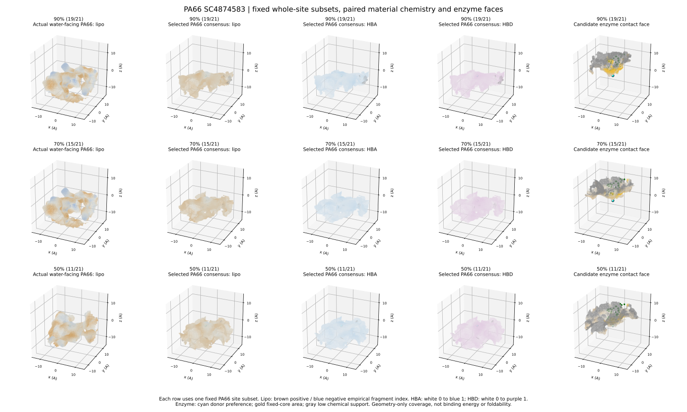

# PA6与PA66：核心条件下材料化学面及候选酶面

补充此前只展示PET的交付缺口。沿用已完成的位点选择与几何计算，没有重算或改变阈值。PA6/PA66各6套固定核心，每套90/70/50%三档，共36档；本次渲染全部12套核心的对比图，GitHub展示下列4套代表，其中2套双残基供体提供三档PyMOL文件。

每张图三行是90/70/50%目标覆盖；五列依次：真实材料代表亲脂性、材料共识亲脂性、材料受体HBA、材料供体HBD、候选酶接触面。

材料棕/蓝表示经验片段亲脂性正/负，不是水合自由能；HBA蓝、HBD紫分别是材料氢键特征。酶面颜色为事后接触偏好，未联合优化亲疏水或结合能。灰色表示共同化学支持不足。

## PA6 N2240（双残基双供体代表）

|档位|实际通过/原核心位点数|平均接触面积比例|
|---|---:|---:|
|90%|9/9|27.8%|
|70%|7/9|32.7%|
|50%|5/9|39.9%|

PyMOL：[90%档](PA6_N2240_coverage90_material_view.py) · [70%档](PA6_N2240_coverage70_material_view.py) · [50%档](PA6_N2240_coverage50_material_view.py)

## PA66 N0564（双残基双供体代表）

|档位|实际通过/原核心位点数|平均接触面积比例|
|---|---:|---:|
|90%|11/12|26.1%|
|70%|9/12|29.8%|
|50%|6/12|36.0%|

PyMOL：[90%档](PA66_N0564_coverage90_material_view.py) · [70%档](PA66_N0564_coverage70_material_view.py) · [50%档](PA66_N0564_coverage50_material_view.py)

## PA6 SC4415918（单残基双供体代表）

|档位|实际通过/原核心位点数|平均接触面积比例|
|---|---:|---:|
|90%|15/16|21.7%|
|70%|12/16|24.0%|
|50%|8/16|28.3%|
## PA66 SC4874583（单残基双供体代表）

|档位|实际通过/原核心位点数|平均接触面积比例|
|---|---:|---:|
|90%|19/21|20.4%|
|70%|15/21|21.6%|
|50%|11/21|24.2%|
## 使用与边界

下载 *_view.py 后在PyMOL File > Run打开；默认显示材料共识面，可切换material_water_real、*_HBA、*_HBD及enzyme_contact。每次打开一个，避免同名对象冲突。此批窗口实际GUI打开未验证。
90/70/50%分母是每套核心原合格位点；小样本向上取整，例如PA6 N2240的90%要求ceil(9*0.9)=9，不是标签错误。不同核心的分母不同，不能直接用接触比例比较催化活性。
PASS为原0.4 A重原子重叠容差下的离散几何通过，骨架支撑、折叠、能量及动态稳健性未评估。材料展示采用朝水近似SES，碰撞用重原子VDW，与旧q系列不直接数值比较。
全部结果表见[主报告](../whole_site_coverage_v1_20260908/README.md)。其余8张图及全部36个材料查看文件保留在远程项目目录，没有在此声称全量GitHub备份。
