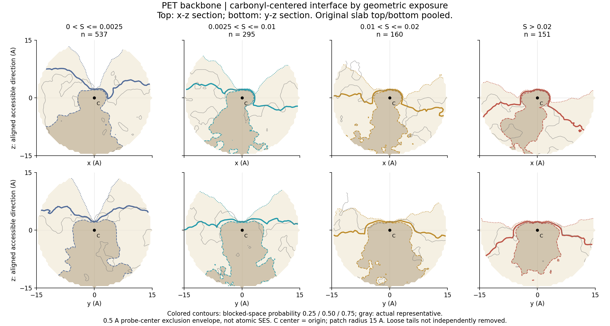
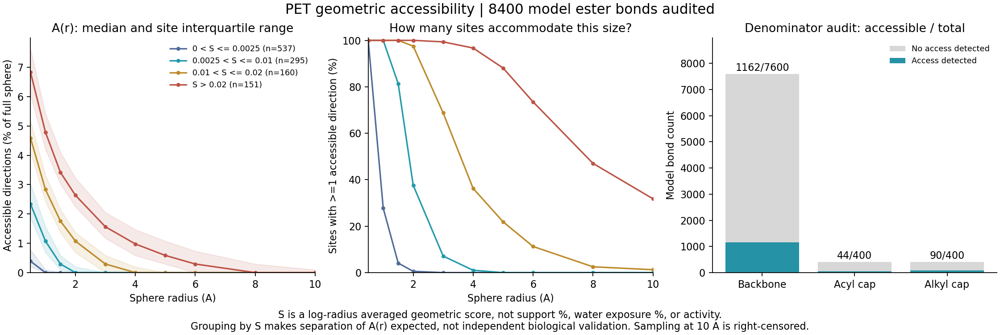

# PET: full-catalogue geometric exposure and aligned interface sections

Numerical audit complete. Figures are descriptive material geometry, not enzyme activity.

All 8400 model bonds audited; 1296 have sampled external access. Main fits use 1143 backbone sites. Caps are separate; loose-tail classification remains NOT_EVALUATED.

## Figures

## Groups

| S_log group | Sites | Median sampled Rmax (A) | Rmax >=4 A | Representative |
|---|---:|---:|---:|---|
| 0 < S <= 0.0025 | 537 | 0.5 | 0 | P175_C75_O32 |
| 0.0025 < S <= 0.01 | 295 | 1.5 | 3 | P065_C35_O16 |
| 0.01 < S <= 0.02 | 160 | 3.0 | 58 | P168_C65_O28 |
| S > 0.02 | 151 | 6.0 | 146 | P115_C95_O40 |

## Interpretation

Main shape panels pool slab top/bottom, translate carbonyl C to the origin and rotate each site's largest r=0.5 A accessible opening to +z. x is projected C=O. No mirror reflection. Two perpendicular cuts are shown to expose anisotropy.

Shape contour values are blocked-space frequency 25/50/75% across each fixed exposure group. They are NOT exposure levels and NOT a guarantee that one enzyme fits that percentage of sites. Gray contour is one actual representative (minimum mean section-field deviation).

S_log = normalized integral of A(r) over log radius, r=0.5..10 A. The score, masks and direction counts are unchanged from the production scan. Display geometry is a 0.5 A probe-center exclusion envelope sampled at 0.5 A, NOT water exposure or atomic SES. The grid uses external connected void, so its curved-path envelope is not a substitute for the strict straight-path score.

Small values of S do not directly mean small water-exposed surface area. No-access sampled sites are reported separately because an opening-based alignment cannot be defined for them without introducing another criterion.

## Limitations

- single snapshot
- loose tails not independently labeled or removed
- caps excluded from main fits but retained in all counts
- zero access is not proof of burial or no curved path
- aligned z maximizes consistency of observed openings, not material normal
- surface envelope uses curved grid connectivity; score uses straight continuous sphere paths
- contours are per-voxel population frequencies, not joint whole-site coverage
- finite-grid morphology is descriptive, not atomistic SES or enzyme shape
- strata are reporting conventions, not validated biological thresholds

Raw per-site masks remain on the server. GitHub publishes figures, summaries, source and assignments; no claim of a full NPZ backup.

Remote output: /data/bht2/polymer_material_reference_20260827/simulation_slabs/interface_surface_robustness_20260908_v1/pet_tangent_figures_20260909_v1
