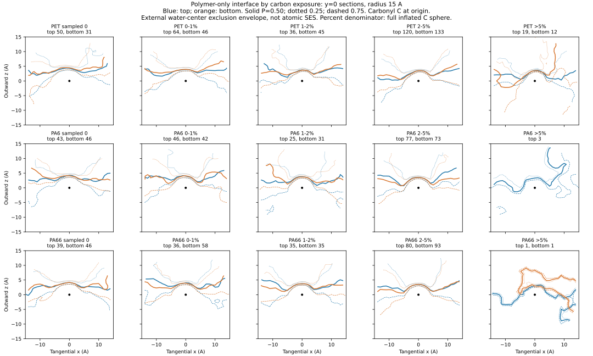

# PET / PA6 / PA66：不依赖酶的暴露分层界面拟合
日期：2026-09-08

## 状态
首轮全量计算和描述性拟合完成。主计算退出码0，耗时199.36秒。29个新版细分分组场逐一从位点场回算一致，分母审计通过。**不等于所有位点的外部水连通性已达到网格收敛。**

本轮不使用三联体、供体、候选覆盖或任何酶适配结果进行筛选。输入是既有的原始块体、内侧支撑>=70%的表面候选：PET578、PA6413、PA66445，共1436个位点。此队列仍受既有密度表面选择条件约束，不是材料所有化学键。

## 最新细分统计
羰基碳暴露比例 = 外部水可接触球面采样点比例，分母为整个半径3.1A球面（碳vdW半径1.7A + 水半径1.4A）；不是“孤立酯键可暴露面积”归一化，也不是反应率。0为4096点采样下未检出，不证明严格零面积。分档是报告约定，没有普适物理阈值含义。

| 材料 | 全部位点 | 采样0 | >0至1% | >1至2% | >2至5% | >5% | 连通性或数值分档待定 |
|---|---:|---:|---:|---:|---:|---:|---:|
| PET | 578 | 81 | 110 | 81 | 253 | 31 | 22 |
| PA6 | 413 | 89 | 88 | 56 | 152 | 3 | 25 |
| PA66 | 445 | 85 | 94 | 70 | 173 | 2 | 21 |

待定分别为：PET20个连通性待定+2个数值分档待定；PA624+1；PA6619+2。已从新版分组均值拟合中排除，不归为埋藏。PA6另有2个位点局部密度法线不满足朝外检查，仍保留在位点统计中，不进入对齐场拟合。因此29个主细分组场合计使用1366个位点。
>5%尼龙样本仅PA63个、PA662个，不足以称稳定共性。大于15%的主分档没有样本。

## 分层界面图


每列一个暴露档；每行一种材料。蓝色为上表面，橙色为下表面；目标羰基C位于原点，+z朝水，x沿羰基方向在切平面上的投影。图为y=0剖面，半径15A。实线为排除占据概率0.5，点线0.25，虚线0.75；后两条不是统计置信区间。

**图示是水探针中心排除包络，不是原子vdW表面、分子SES、蛋白形状或酶的最大体积。** 中心数A的圆顶包含目标原子本身及水半径的必然几何贡献，不能当作新发现的块体表面共性。细分结果使用相同的原始1A场；没有把0.75或0.5A局部诊断混入主图。

## 当前能支持的解读
1. 统一朝水方向后，各材料上下表面的平均轮廓存在相似性，但远非单一精确模具。
2. 暴露水平不足以决定局部形状。在排除中心5A、只看5–15A壳层时，0–5%各组内部位点场平均绝对偏差约0.270/0.276/0.274；同侧不同暴露档均值场之间差异约0.057/0.064/0.057（PET/PA6/PA66）。这是相同0–1占据场上的描述性对比，不是独立显著性检验。**组内变化明显大于分档平均变化**。
3. 探索性2–4类形状聚类在满足样本量的组中没有达到预设的清晰且初始化稳定条件；不强行命名“平面/凸面/凹槽”。
4. 下一步若需要界面模板，应保留连续形状变化、代表真实位点和开放方向，不仅保存一个平均面。此轮未把这些包络解释为催化可行性。

## 方法与审核
- 原始全原子环境，XY周期边界；不使用未封端裁剪碎片。
- 1A全局自由空间网格，从上下外部水空间连通，6邻域且连接XY周期边；局部球面点到外部网格节点的路径作8点检查。
- 羰基C使用4096个Fibonacci球面点；局部无碰撞面积与外部连通面积分别保存。二者跨越分档边界时标为连通性待定。
- 局部法线为3A高斯平滑质量密度的负梯度，保留化学坐标系到表面坐标系变换。
- 15A邻域场在完整材料环境下计算后截取；不因截取邻域而重新制造暴露。
- 既有70–80%、80–90%、90–100%内侧支撑区间另有分层；它们不是暴露百分比。
- 主宽分组81个非空场，新细分29个场；分层存在重叠，不是110个独立材料样本。
- 原始链分组bootstrap仅在至少5条链时提供；是单快照条件下的诊断，未消除跨链空间相关。
- 86个位点做0.75A网格/8192点抽查；12个重点位点做0.5A诊断。仍有PET及PA66狭窄开口对网格敏感，不能宣称全局收敛。
- 抽查发现5个已分档位点跨越极低暴露/零或5%边界，fine_strata_v2将其另标为NUMERICAL_BIN_UNCERTAIN。没有覆盖旧版。
- 合成测试覆盖封闭空腔、XY周期连通、周期距离、孤立碳球面与右手坐标系；另查平面形状和恒定场不产生伪聚类。
- 体积场拟合逐一回算一致，所有1436个位点及待定分母闭合。
- 目前只有一个构象快照，不证明动态稳定性。元素附近体素计数仅是化学注释，不是定量亲疏水或静电势。

## 结果位置与复现
远程主目录：
`/data/bht2/polymer_material_reference_20260827/simulation_slabs/interface_surface_robustness_20260908_v1`

最新主细分结果：`polymer_exposure_fine_strata_v2/`
- 各材料：`site_bin_assignments.json`、各分组`.npz`和`.dx`；
- `summary.json`含每组样本数、链数、代表位点；
- `fine_interface_sections.svg/.png`。

原始逐位点结果：`polymer_exposure_full_v2/{PET,PA6,PA66}/sites.json`和`site_fields.npz`。
核查：`polymer_exposure_audit_v1/`、`polymer_exposure_grid05_diagnostic_v1/`。
失败的首个试算和旧版细分结果均保留。新流程的计划、脚本和报告已保存到GitHub现有分支；本地没有新写入或安装。

CPU环境：
`/data/bht2/polymer_material_reference_20260827/simulation_slabs/unbiased_100chain_v1/env/bin/python`

主计算重跑命令（在项目目录，以新输出名避免覆盖）：
```
OPENBLAS_NUM_THREADS=1 OMP_NUM_THREADS=1 /data/bht2/polymer_material_reference_20260827/simulation_slabs/unbiased_100chain_v1/env/bin/python polymer_exposure_v2.py --output NEW_UNIQUE_OUTPUT --grid 1 --samples 4096
```
审计和细分脚本使用本轮固定输入目录；再次执行需先指定新的版本化输出目录，不能覆盖现有产物。
来源代码：`work/polymer_exposure_v2.py`、`work/polymer_exposure_audit_v1.py`、`work/polymer_exposure_grid05_diagnostic_v1.py`、`work/polymer_exposure_fine_strata_v2.py`。
源代码SHA256：
- 主计算：4267a084e23a6b28b402fd9a4563a59debae097a0b2be546f4e2ce6701caa71c
- 新版细分：fec08709134c2511838c99d9b20ac1b731c7100e9f7c57fd2e012fc4430a463f
