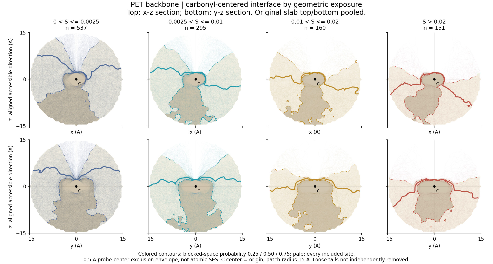
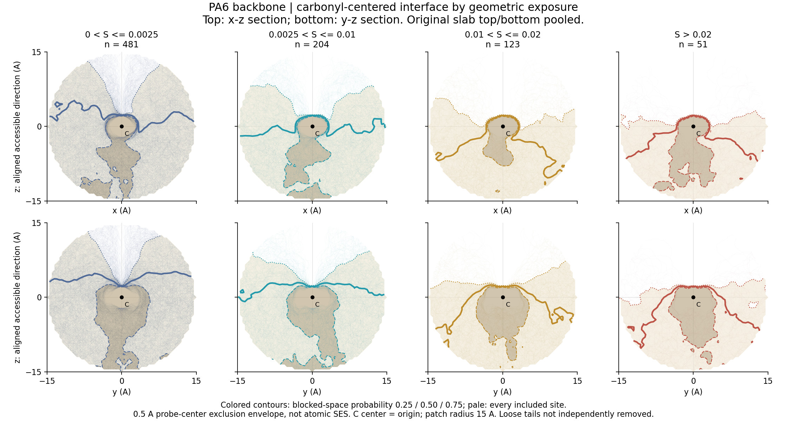
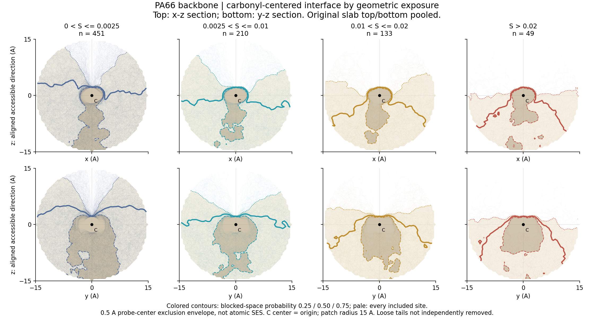

# PET / PA6 / PA66：全部入组位点的浅色界面叠图

PA6、PA66 全量可及性计算已完成，各 6800 个模型酰胺键；PET 8400 个模型酯键。分组和图形使用相同的几何定义。

浅色细线：每个入组位点的实际截面（透明度 0.025），不是抽样代表。深色实线：50% 阻挡空间频率轮廓；点线25%，虚线75%。上下排是两个垂直截面，原 slab 上下表面合并。黑点是羰基碳原子中心；+z 是对齐后的主要开放方向。

| 材料 | 可及主链位点 | 入图位点 | 实际截面条数 |
|---|---:|---:|---:|
| PET | 1162 | 1143 | 2286 |
| PA6 | 877 | 859 | 1718 |
| PA66 | 851 | 843 | 1686 |

## PET

[可及性统计图](pet/pet_exposure_statistics.jpg) · [完整核验摘要](pet/summary.json)

| S_log 区间 | 位点数 | 采样最大可达半径中位数 (Å) |
|---|---:|---:|
| 0 < S <= 0.0025 | 537 | 0.5 |
| 0.0025 < S <= 0.01 | 295 | 1.5 |
| 0.01 < S <= 0.02 | 160 | 3 |
| S > 0.02 | 151 | 6 |

## PA6

[可及性统计图](pa6/pa6_exposure_statistics.jpg) · [完整核验摘要](pa6/summary.json)

| S_log 区间 | 位点数 | 采样最大可达半径中位数 (Å) |
|---|---:|---:|
| 0 < S <= 0.0025 | 481 | 0.5 |
| 0.0025 < S <= 0.01 | 204 | 1.5 |
| 0.01 < S <= 0.02 | 123 | 3 |
| S > 0.02 | 51 | 6 |

## PA66

[可及性统计图](pa66/pa66_exposure_statistics.jpg) · [完整核验摘要](pa66/summary.json)

| S_log 区间 | 位点数 | 采样最大可达半径中位数 (Å) |
|---|---:|---:|
| 0 < S <= 0.0025 | 451 | 0.5 |
| 0.0025 < S <= 0.01 | 210 | 1.5 |
| 0.01 < S <= 0.02 | 133 | 3 |
| S > 0.02 | 49 | 8 |

## 方法与边界

- 原始可及性分数、球半径和方向采样未修改；不是重新扫描。绘图复用同一材料快照，重新生成并保存逐位点截面数组。
- 图中的“全部”是每个暴露档纳入的全部主链位点。封端相关位点另列；路径上限带来的分档不确定位点不混入图中。未检出开放方向的位点无法按开放方向对齐，未纳入这些形状拟合；不能因此认定全部是内埋位点。
- 连接在块体上的松散链段尚未独立分类或剔除。本图不能称为纯致密块体表面。
- 轮廓是0.5 Å几何探针的外部连通空域排斥包络，不是原子级SES、水暴露或酶形状。图形的网格连通允许曲线路径；可及性评分使用连续直线路径，两者不要混同。
- 25/50/75%是逐空间位置的群体阻挡频率，不是某个酶可同时覆盖该比例位点的保证。浅色线看形状分散，不将线条深浅直接当作概率。
- 颜色代表暴露档，不是亲水疏水性；S_log 是经验几何分数，不是活性。
- PET 新版分组成员和共性轮廓与旧版完全一致。三种材料全部截面均非空，实际绘图条数与2×入组位点数一致。
- JPEG是原始PNG的网页预览（quality90，subsampling0）；原始PNG/SVG、位点表和逐位点截面NPZ保留在服务器，不声称全部已上传。

服务器项目：/data/bht2/polymer_material_reference_20260827/simulation_slabs/interface_surface_robustness_20260908_v1

每种材料输出目录：{pet,pa6,pa66}_tangent_figures_all_sites_20260909_v2/。脚本见仓库 work/{pet,pa6,pa66}_tangent_figures_all_sites_v2.py；CPU已有环境重跑需要新输出目录，勿覆盖旧结果。
