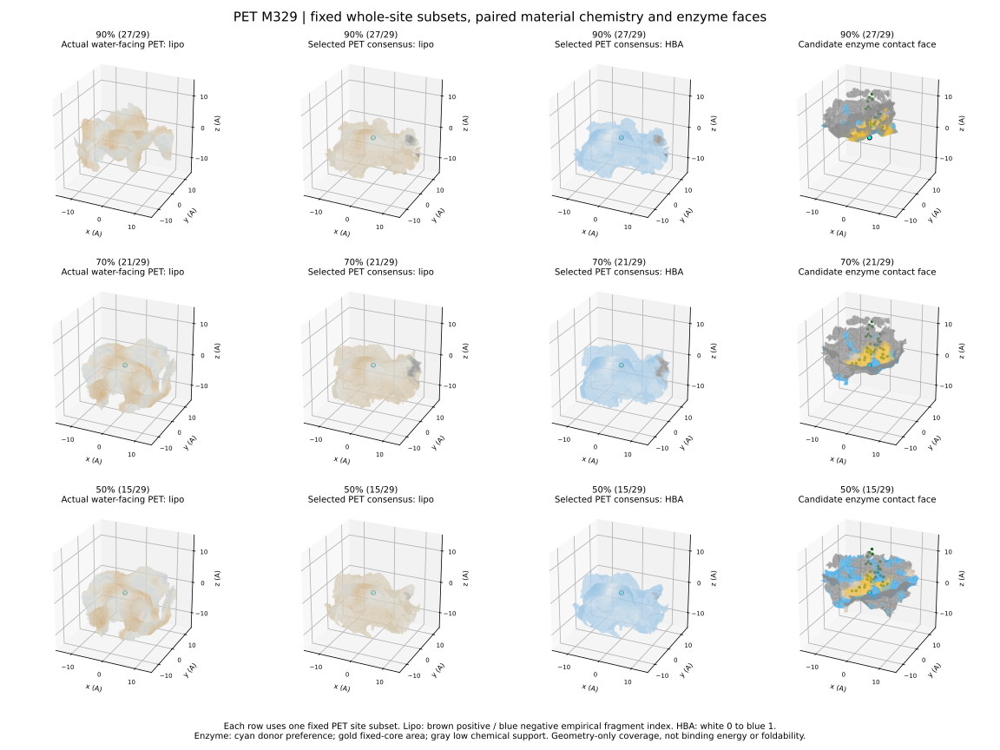

# 核心条件下的90/70/50%完整位点覆盖界面

本轮使用同一固定核心、同一组完整位点，不使用逐点q分位数。每档配对给出材料朝水外表面、材料化学分布、真实代表位点和候选酶接触面。

## 分母与验收

分母是该固定核心原来的合格材料位点，不是全PET/PA6/PA66位点。目标位点数取ceil(N*比例)。先从每个位点作为起点贪心选择同一子集，在空间中尽量保留局部蛋白体积；各档验证前3个候选子集，再选择通过覆盖目标且接触面积较多的一个。这是启发式搜索，未证明全局最优。
原核心与供体坐标保持不变。沿用原重原子范德华半径和0.4 A重叠容差；对整张局部接触面顶点、边中点、面中心、局部1 A蛋白占据网格及固定核心逐位点检查。PASS是该离散几何口径的通过，不是完整蛋白可折叠或有活性。

## 全部结果

|材料|核心|分母|90%实际通过/要求|70%实际通过/要求|50%实际通过/要求|90/70/50%所选位点平均接触面积%|
|---|---|---:|---|---|---|---|
|PET|SC1345656|44|40/40 (PASS)|31/31 (PASS)|22/22 (PASS)|15.5/17.0/18.9|
|PET|SC1989827|40|36/36 (PASS)|28/28 (PASS)|20/20 (PASS)|16.3/18.7/19.7|
|PET|SC3000704|41|37/37 (PASS)|29/29 (PASS)|21/21 (PASS)|16.0/18.0/20.2|
|PET|M450|31|28/28 (PASS)|22/22 (PASS)|16/16 (PASS)|18.5/20.1/22.5|
|PET|M329|29|27/27 (PASS)|21/21 (PASS)|15/15 (PASS)|19.6/22.4/25.7|
|PET|M318|26|24/24 (PASS)|19/19 (PASS)|13/13 (PASS)|21.5/22.8/27.0|
|PA6|SC4399876|17|16/16 (PASS)|12/12 (PASS)|9/9 (PASS)|19.9/22.4/26.2|
|PA6|SC4415918|16|15/15 (PASS)|12/12 (PASS)|8/8 (PASS)|21.7/24.0/28.3|
|PA6|SC4927359|16|15/15 (PASS)|12/12 (PASS)|8/8 (PASS)|20.2/22.4/27.5|
|PA6|N2240|9|9/9 (PASS)|7/7 (PASS)|5/5 (PASS)|27.8/32.7/39.9|
|PA6|N1626|6|6/6 (PASS)|5/5 (PASS)|3/3 (PASS)|39.7/42.8/52.1|
|PA6|N2403|6|6/6 (PASS)|5/5 (PASS)|3/3 (PASS)|35.9/37.8/57.0|
|PA66|SC4874583|21|19/19 (PASS)|15/15 (PASS)|11/11 (PASS)|20.4/21.6/24.2|
|PA66|SC4927359|17|16/16 (PASS)|12/12 (PASS)|9/9 (PASS)|20.9/22.3/27.8|
|PA66|SC4309501|18|17/17 (PASS)|13/13 (PASS)|9/9 (PASS)|21.4/23.1/29.9|
|PA66|N0564|12|11/11 (PASS)|9/9 (PASS)|6/6 (PASS)|26.1/29.8/36.0|
|PA66|N2240|12|11/11 (PASS)|9/9 (PASS)|6/6 (PASS)|26.4/27.5/37.0|
|PA66|N2303|12|11/11 (PASS)|9/9 (PASS)|6/6 (PASS)|25.7/29.4/36.3|

## 材料亲疏水及查看方式

材料展示使用此前基于外部连通水得到的近似SES朝水表面，保持固定核心坐标系；碰撞检查则使用原筛选的重原子范德华体积。两者用途不同，不能拿SES图上的相交代替原子碰撞判定。每档的材料面、化学统计和酶面都来自同一份selected_site_ids。
片段亲脂性按完整化学图计算Wildman-Crippen原子贡献（显式H归入相邻重原子），8近邻1.5 A平滑。棕正/蓝负是经验片段指数，不能当成真实水合自由能；材料HBA/HBD有独立图层。灰色为共同近表面支持不足，不是疏水。

PyMOL查看文件默认显示material_water_consensus。可禁用后启用material_water_real查看真实代表，*_HBA和*_HBD查看材料氢键特征；enzyme_contact是酶面。黄色D1/D2和球棍为固定供体/核心，青色点为羰基C，不是暴露面积。

## 当前边界

- 没有新增MD或供体采样，基于既有单快照和原位点名单。
- 共识面仍可能因平均而变平；真实代表面保留凹凸。没有人为要求平面，也没有为了显示凹凸强制制造曲率。
- 平面只是形状表现，主要目标是完整位点覆盖与接触；90%和50%子集不保证嵌套，三档名单均保存。
- 接触面积定义为界面顶点到材料重原子VDW表面的距离在[-0.4,1.5] A内的面积比例，随后按所选位点平均；这不是结合能。
- 蛋白骨架支撑、完整外形、折叠、动态稳健性、界面氢键方向与能量仍为NOT_EVALUATED。
- 与旧q系列不仅覆盖定义不同，碰撞表示也已统一回原筛选口径，旧新数值不可直接当作纯算法提升比较。
- 全部原始网格与54个成对查看文件保留在远程；GitHub发布摘要、图和M329三个代表查看文件，不是全量备份。

## M329直接查看

- [90%位点覆盖：材料＋核心＋酶面](PET_M329_coverage90_material_view.py)
- [70%位点覆盖：材料＋核心＋酶面](PET_M329_coverage70_material_view.py)
- [50%位点覆盖：材料＋核心＋酶面](PET_M329_coverage50_material_view.py)

M329加密复核：每三角形21个重心采样、0.5 A局部体积网格，三档仍通过27、21、15个位点。其他核心采用上述常规离散复核，未全部加密。
